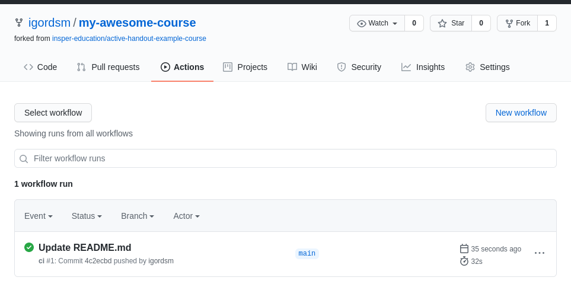

# Preparatory tasks

Welcome to "Creating and Publishing Active Learning Handouts". This set of preparatory tasks was created to avoid spending precious synchronous time with tasks like creating accounts or configuring software. 

## Task 1 - visit some resources

The first step is to become familiar with the type of course materials that can be created using [Active Handout](https://insper-education.github.io/active-handout/), the tool we will use in this workshop. We selected some interesting examples of handouts created using this tool:

* **High Performance Computing**
    * [Introduction to Paralelism](https://insper.github.io/supercomp/aulas/12-paralelismo/)
    * [Schedule](https://insper.github.io/supercomp/sobre/)
    * [Report rubric](https://insper.github.io/supercomp/projetos/relatorio-2/)
* TODO: elementos ou embarcados vem aqui

!!! question short
    Browse the resources above. Are there feature(s) you would like to incorporate in your pedagogical practice? List them below.

    !!! details
        Your answer will be saved locally in your browser. Use these questions as a way to create a digital notebook.

!!! progress
    Continue

## Task 2 - creating a Github account

GitHub is a tool to host software repositories and documentation with a focus on collaboration. In this Workshop it will be used to host our course materials. 

* Multiple instructors can easily collaborate to write and update material;
* Course materials are available as a webpages, but can also be entirely downloaded to students' and instructors' PCs.
* Students can create private copies of the course repository to store their own solutions and homework;

!!! tip 
    The main advantage of basing a course on *Active Handout* is the ability to incorporate new resources into your courses. When a new release is made all users can choose to update their version of *Active Handout* and use the new features or stay with their tried and tested version.

!!! warning "If you already have an account, skip to task 3"

!!! Task
    Visit [Github](https://github.com/signup) and create and account. The website will guide you during the signup process. Choose an username that is unique and professional.

!!! question short
    Write your github username below.

    !!! details
        Your username will be part of the URL of your newly created materials. Store it with care!

!!! progress
    Continue

## Task 3 - create your first course repository

We will base our workshop in [Active Handout's Example Course](https://insper-education.github.io/active-handout-example-course/). It contains a pre-configured basis for new course materials and we will base all workshop activities on this repository.

!!! task
    Visit [Active Handout's Example Course](https://insper-education.github.io/active-handout-example-course/). Browse for a bit and then visit its *GitHub repository page*. 

    !!! video
        

!!! question short
    Now we will create a new repository for your course. Choose a name and write it below. Only Numbers, Letters and dashes `-` can be used.

    !!! details
        The URL of your course will be `https://username.github.io/coursename`.

A key concept in Github is **forking** a repository. When you **fork** a repository you create a relationship between the original (Example Course) and the newly created repository, which we refer to as *your fork*.

TODO: Thus, 

!!! question choice
    When we refer to *your fork* it means:

    - [X] My course's repository, which I will create in this section.
    - [ ] Active Handout's Example Course repository 

!!! task 
    Create a fork of [Active Handout's Example Course repository](https://github.com/insper-education/active-handout-example-course). Follow the video below. If prompted where to create the fork, choose your own username. 

    !!! video
        

!!! tip
    By default, *your fork* will have the same name as the original (`active-handout-example-course`). 

!!! task
    Now let's rename our repository. Follow the instructions below. Use the name you chose in a previous question.

    !!! video
        

!!! question short
    Write the repository url of *your fork* below. You can copy it from your browser's address bar.

    !!! details
        This address will be used to find your repository online so others can contribute. Think of this URL as the place where other people will go if they want to download a copy of the entire course.

Now we will configure *your fork* to be published as a website. This will be done in two parts:

!!! task
    First, we check if *Pages* are enabled in our repository settings. It is the second last option in the *Settings* tab. Make sure the values are the same as in the video.

    !!! video
        

!!! question short
    In the last step of the previous task *Github* showed the address our course materials will be published. Write it down here.

    !!! details
        This changes according to your username and repository name.

!!! task
    Then we will configure *Github* to automatically publish our course to the web everytime we make a modification. We bundle a *Github workflow*  with the example course, so we just need to active it in the repository.

    !!! video
        

!!! done "Now everything is setup!"

!!! progress
    Continue

## Task 4 - your first modification

Our repository is now good to go. So let's make a modification and see our course materials being built.

!!! task
    We will make a very simple modification and edit the `README.md` file. This is an important file, as it is presented when people visit your repository. You can follow the video instructions on how to modify files directly online using *Github*.

    !!! video
        

After every modification a *Action* is triggered and our website is updated. 

!!! task
    Visit the *Actions* tab. It should show something similar to the image below.

    

!!! done "Visit the website URL you noted before to see your materials online."

!!! progress
    Continue

## Task 5 - bring your own material

During the workshop we will customize the provided example course. To better take advantage of the workshop, you can bring your own course materials and use them in the workshop activities. 

!!! task
    Select some of your existing course materials and bring them with you. Some suggestions are:

    1. A powerpoint presentation
    2. A lab handout in Word

!!! warning "We will provide example materials for those who do not bring their own."
