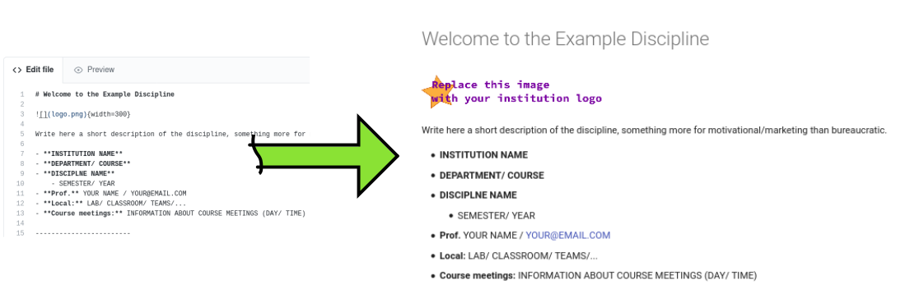
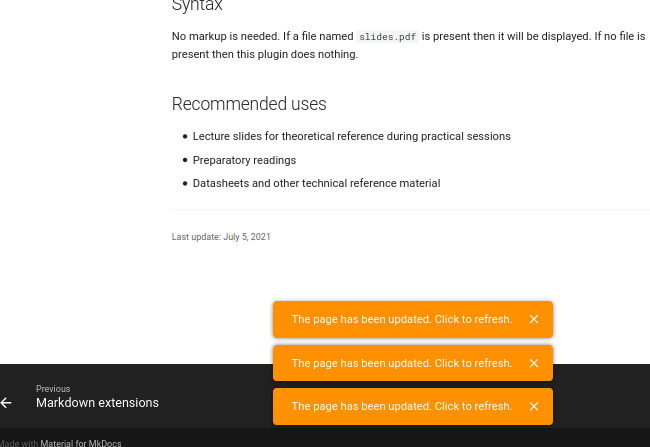

# Part 1 - Editing first page

Now we will edit the site created in the previous step by adding content to it.

The example provided has a [base homepage](https://insper-education.github.io/active-handout-example-course/), created from our experiences and based on the site of disciplines from other universities, the first step of the activity will be to add content and customize this homepage.

After editing the home page we will port a practical class activity created in word/powerpoint to the course page. 

## Directory Structure

In the proposed structure all pages are markdown text files, including the first one. The way we organize the discipline repository is:

- / : root directory
- `README.md`: README file that explain the repository
- `content/`: Directory that contains the files related to the webpage
- `mkdocs.yml`: Webpage config file (we should edit this file to add a new page)
- `.github/`: Github actions config file (were we configure the autodeploy)
- `requirements.txt`: Python plugins needed to create the webpage

??? info "files"
    {width=500}

## First page 

The `content/` directory has a `index.md` file, which is responsible for generating the first page. To edit the first page you need edit this file, to do this open your your clone repository on the github platform than: :arrow_right: `content/` :arrow_right: `index.md` :arrow_right: **Edit this file** :ok: as shown below:

!!! video
    

!!! progress
    Continue

!!! tip "Markdown"
    If you need, we create a small markdown reference:
    
    - [Basic text editing with markdown](https://insper-education.github.io/active-handout/reference/basic-editing/)
    - [Markdown extensions](https://insper-education.github.io/active-handout/reference/advanced-editing/)

!!! info "Editor"
    We will suggest editing the material via the github website, if you prefer you can edit the location in your preferred text editor.

This will open the file to be edited on the github. Now you can edit this file. Lets first modify a small part of the file and see the generated page.
Edit only the first part of the markdown file to reflect a subject you teach/ course. You should edit the begin of the file up to the **Course meetings** item.

## Publishing 

When finished editing click on **Commit changes** buttom at the botton of the page, this will trigger the CI to generate the web page.
The process is automatic and takes around 1 minute.

??? tip
    {width=600}

!!! info "Tools"
    On the process to generate the final webpage we are using the fallowing tools:
    
    - [MkDocs](https://www.mkdocs.org/): Generate a static site from markdown files
    - [Material for MkDocs](https://squidfunk.github.io/mkdocs-material/): The webpage theme 
    - [Github actions](https://github.com/features/actions): CI/CD to deploy the webpage
    - [Insper Active-handout](https://insper-education.github.io/active-handout/): A set of config/extensions to the mkdocs/material to improve the use on a handout.
    
### Extras

While you wait you can:

1. Edit the rest of the `index.md` file;
1. Explore some of insper's disciplines that use this tool:
    - [3s The Elements of Computer System](https://insper.github.io/Z01.1/)
    - [5s Embedded Computer](https://insper.github.io/ComputacaoEmbarcada/)
    - [SoC and Embedded Linux](https://insper.github.io/Embarcados-Avancados/)

!!! tip
    You will get a notification on the webpage indicating that it was updated. This feature is included on the Insper Active Handout extensions.
    
    {width=500}
