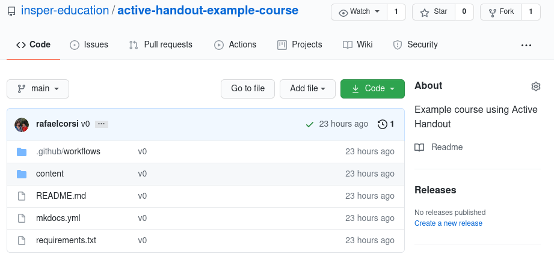
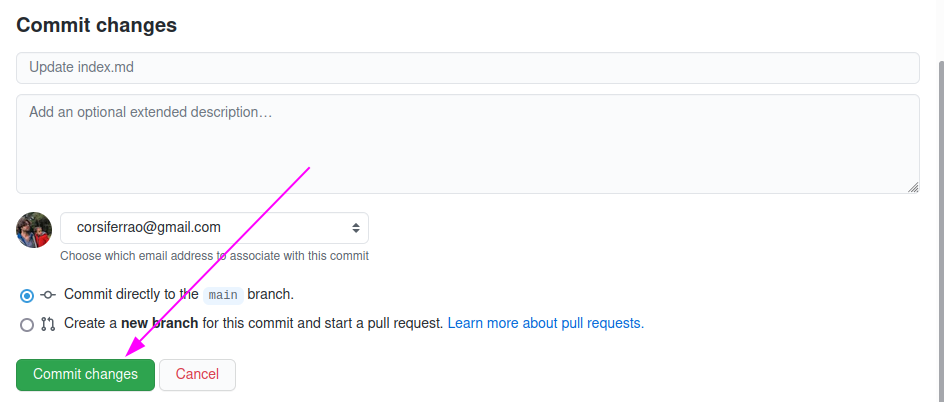
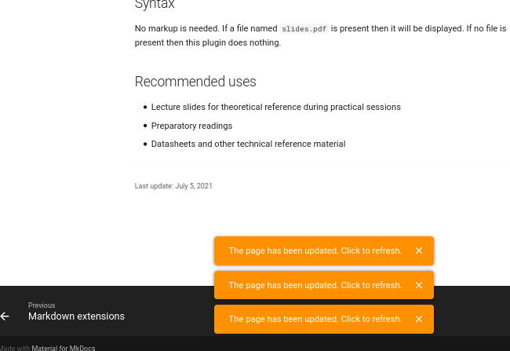

# Editing first page

In this handout we will

* Edit the home page of a course to add basic information about it.
* Format documents using Markdown

The first page a student sees when they access your course should contain information about the course, like instructors' contacts, schedule and learning goals. The example course provided has a [base homepage](https://insper-education.github.io/active-handout-example-course/) that we use at Insper. It was created from our collective experience and also based on the site of disciplines from other universities.

In this activity we will customize this page to a course of your liking. 

## Finding yourself

All courses based on *Active Handout* follow the same basic structure:

{width=500}

- / : root directory
- `README.md`: README file that describes the repository
- `content/`: This is where we put course materials
- `mkdocs.yml`: Webpage config file (we should edit this file to add a new page)
- `.github/`: Github actions config file (where we configure the autodeploy)
- `requirements.txt`: Python packages to build a local environment

Inside the `content/` folder we find a `index.md` file. This file contains the home page of our course. Let's start working on it.

!!! task
    Open *your fork* in the browser and enter the `content/` folder. Then, click on `index.md` to view its contents.

!!! task 
    In a second tab or window, open the webpage of your course materials. This is the address you've written in the previous section. It is formed by `https://your-username.github.io/repository-name`.

`index.md` is a *Markdown* file. Basic formatting is written in plain text and is supposed to be readable without using other tools. 

??? tip "Markdown tips"
    If you need, we created a small markdown reference:
    
    - [Basic text editing with markdown](https://insper-education.github.io/active-handout/reference/basic-editing/)
    - [Markdown extensions](https://insper-education.github.io/active-handout/reference/advanced-editing/)

!!! task
    Click on the *Edit this file* button (a small pen icon besides *Raw* and *Download* ). Edit only the first part of the file to reflect a course of your liking. You should edit the begin of the file up to the **Course meetings** item.

    !!! video
        

!!! progress
    Continue

After editing the file we need to save them so *Active Handout* can build the final website. The process is illustrated in the Figure below.

!!! task
    When finished editing click on **Commit changes** at the bottom of the page. This will trigger a rebuild process of your course materials. This is automatic and takes about 1 minute.

    {width=600}

!!! tip
    You will get a notification on the webpage indicating that it was updated. This feature is included on the Insper Active Handout extensions.
    
    {width=500}

!!! info "Tools"
    On the process to generate the final webpage we are using the fallowing tools:
    
    - [MkDocs](https://www.mkdocs.org/): Generate a static site from markdown files
    - [Material for MkDocs](https://squidfunk.github.io/mkdocs-material/): The webpage theme 
    - [Github actions](https://github.com/features/actions): CI/CD to deploy the webpage
    - [Insper Active-handout](https://insper-education.github.io/active-handout/): A set of config/extensions to the mkdocs/material to improve the use on a handout.
    

### Extras

While you wait you can:

1. Edit the rest of the `index.md` file;
1. Explore some of insper's disciplines that use this tool:
    - [3s The Elements of Computer System](https://insper.github.io/Z01.1/)
    - [5s Embedded Computer](https://insper.github.io/ComputacaoEmbarcada/)
    - [SoC and Embedded Linux](https://insper.github.io/Embarcados-Avancados/)
