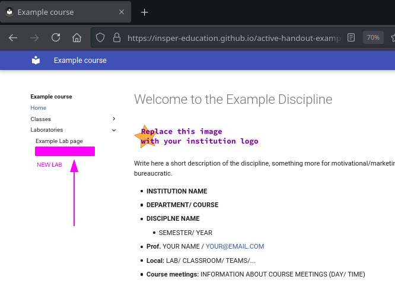
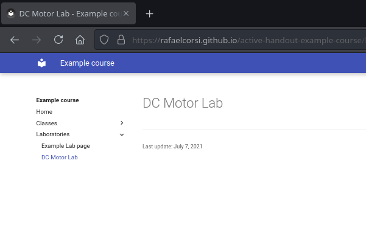
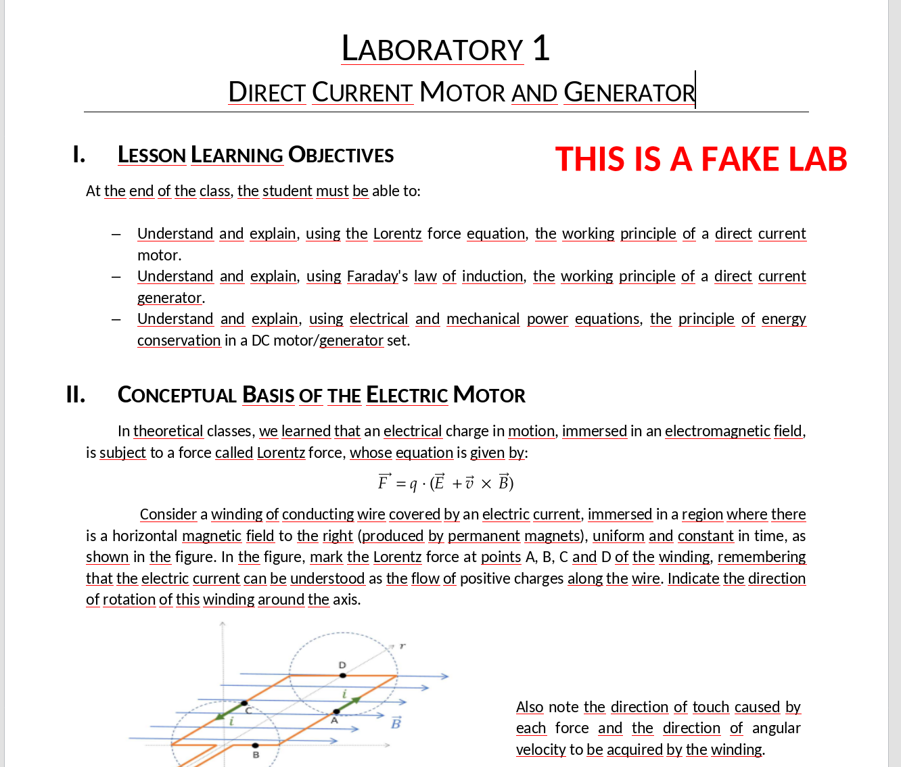
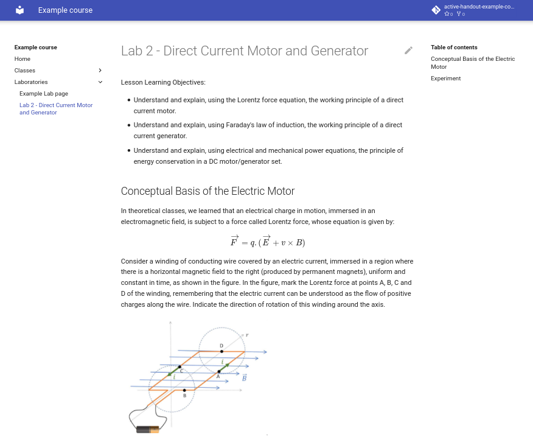

# Creating a new handout

Let's create a new laboratory handout on our course page. The following steps represent an overview of this process:

1. Create the laboratory folder (`02-DCMotor`) and `index.md` file
1. Add the new page to the `mkdocs.yml`
1. Add content to the your lab (editing the `index.md` file)

This new content will appear on the website's outline (on the left).

{width=500}

!!! info
    This script was created based on an example (fake) lab: **Direct Current Motor and Generator**. If you brought your own materials, feel free to use them in this handout. 
    
    You can download the [material here](DcMotorLab.zip)

## Creating the lab files

In our experience, it helps to organize course material taking into account some "rules":

- Separate `labs` and `classes` into different folders
- Create a folder for each lab or class
- Number each folder (`ie: 01-ExampleLab`). This makes it easir to refer to activities in text and slides.
- Each folder holds:
    - `index.md`: A markdown file with the class material
    - Images, presentation and extra material for that specific activity

!!! question short
    Name your lab below. The folder name should be related to the title of the lab.
    
    !!! details
        If you are using the provided course materials, it could be something along the lines of `02-DcMotor`. We use `02-` at the start because the example course already has a first lab.

!!! task
    Enter the `lab` folder (inside `content`). Then create a file inside it. The folder `02-DcMotor` does not exist yet, so we'll create it together with our file. Follow the video below to create a file and a folder at the same time.

    !!! video
        

!!! task
    Now you should be in the *Edit* page. For now, let's just add a title and save the file (using the green *Commit changes* button at the bottom of the page).

    ```
    # DC Motor Lab                .
    ```

??? tip "Markdown tips"
    In Markdown titles are lines starting with a single `#`. The first title appears in the outline on the left. 

!!! progress
    Continue

## Adding the new page to `mkdocs.yml`

With our (rather empty) page created, we now need to add it to the outline. We'll use the same method of editing a file online on Github.

!!! task
    Open the edit page for `mkdocs.yml`, located at the root of your repository.

!!! task
    Find the **nav** section and add the path to your recently created file. In our case we're using `labs/02-DcMotor/index.md`, but you should adapt it to the name of the folder created in the previous questions. 

    ```diff
    nav:
    - Home: index.md
    - Classes:
        - classes/01-ExampleClass/index.md
    - Laboratories:
        - labs/01-ExampleLab/index.md
    +   - labs/02-DcMotor/index.md
    ```

    !!! video 
        

After the build and deploy process you should see the new page on the page of your website:



!!! warning
    Remember that the process can take up to one minute.

??? tip "Editing tips"
    The steps done earlier may seem complex, but once you get the hang of it, it's not that different from editing local files in Word or PowerPoint. It is also possible to edit files offline locally on your computer without using Github.

!!! progress
    Continue
    
## Adding content

**Now we come to the most interesting part of the tutorial: creating the activity that will be shared with the students.** This section is based on our [fake Physics lab](DcMotorLab.zip), but any course materials can be used. Our main objective here is creating pretty formatted text, so we are not particularly interested in the contents. 


!!! task
    If you are using our [fake lab](DcMotorLab.zip), download and extract it in your PC. If you are not, locate the files you want to use and keep them ready.

    Our fake lab contains 5 files, word document with the lab instruction and four images that were extracted from the document.

The image below illustrates the type of document we'll be using. 

{width=400}

We can identify the following elements in this lab:

- Title
- Sections 
- Theory (text explanations)
- Lists
- Equations
- Figures
- Questions 
- Code

We will learn how to create these elements in Markdown. The end result will be similar to the Figure below. A live version is available at [Rafael's example materials](https://rafaelcorsi.github.io/active-handout-example-course/labs/02-DcMotor/). The sources can be [seen here](https://raw.githubusercontent.com/rafaelcorsi/active-handout-example-course/main/content/labs/02-DcMotor/index.md)




!!! task
    To type text you can just write on the file. To separate paragraphs use a blank line. For titles, start a line with `#` and then follow with an empty line. For sections, start a line with `##` and then follow again with an empty line. The example below illustrates these features:

    ```
    # this is a title

    paragraph

    ## a section

    another paragraph
    ```


lista aqui

!!! warning
    We suggest that you check the generated site frequently to see if it is in accordance with what you want.

!!! tip "Uploading images"
    You need to upload the images to the lab folder before using. This can been done in github by going to the folder you want to upload to and then clicking *Add file* :arrow_right: *Upload* :ok:
    
    !!! video
        

!!! task
    Images are included using the following format:

    ```
    
    ```

    `filename.png` is the name of the image and should match the name that you used in the *Upload* step.

!!! task
    Equations can be directly written using `LaTex` math notation. Write some formulas on your text and see the final result online.

    If you don't know `LaTex` notation, you can use the following to test this feature. Put it in a separate paragraph.

    ```
    $$
    \sum_{i=1}N \frac{\Phi(x_i)^2}{i}
    $$
    ```

!!! task
    Questions can be created using a especial notation called *Admonition*. It follows 

## Further references


Markdown is practical, but it has limitations and as we use it we will learn to work around.  For ideas see:

- [Basic text editing with markdown](https://insper-education.github.io/active-handout/reference/basic-editing/)
- [Markdown extensions](https://insper-education.github.io/active-handout/reference/advanced-editing/)
    