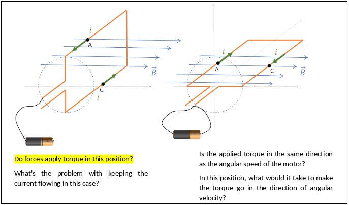

# Adding interactive content

Now let's see how to add interaction to the lab done previously, for that we'll use some tools developed by us and that integrate in the infrastructure used previously. The system composed of opensource tools + our extensions is called Insper Active Handout and has its own page that can be accessed at:

- https://insper-education.github.io/active-handout/

And you can track the development and the new ideas that will be implemented on the git repository:

- https://github.com/insper-education/active-handout/issues

!!! info
    If you want you can contribute to the project by giving suggestions for new tools (open a new issue), participate in the discussion of an existing issue or help with the implementation of new features/bug fixes.

==All tools are accessed via markdown commands==, it's one of our development principles, not having to rely on creating and editing on external tools. This facilitates the creation of new content and the possibility of using the versioning system in the course material

## Interactions

Now let's see some tools available for use and we'll use them to modify our previously created lab by adding interactivity to it.

### Video

!!! info ""
    Please access the [Video plugin page](https://insper-education.github.io/active-handout/reference/video/) for more information 

To add a video to your lab use the fallowing syntax:

=== "markdown"
    ```
    !!! video
        
    ```
    
=== "result example"
    ```
    !!! video
        
    ```

    !!! video
        
       
Recommended uses:

- Video of a short explanation of the activity, showing the expected results
- Recap the theory or introduce something new
- Bring external references to the discipline, current affairs, or curiosities
    
!!! info ""
    The extension accept local or youtube video. You can also use videos from elsewhere using the embed tool.
 
!!! task
    Add a video to the begin of the lab, the video can be a brief review of the subject or some content that motivates/curiosities about the lab.
    
    ??? info "A possible solution"
        ```
        !!! video
            
        ```
      
### Quiz

!!! info ""
    Please access the [Quiz plugin page](https://insper-education.github.io/active-handout/reference/quiz/) for more information.

You can easily add a quiz using the fallowing syntax:

=== "markdown"
    ```
    !!! question choice
        Text of the question. 

        - [ ] option 1
        - [ ] option 2
        - [X] correct option

        !!! details
            Text explaining correct answer. Only shown after option is selected.
    ```
=== "Result"
    !!! question choice
        Text of the question. 

        - [ ] option 1
        - [ ] option 2
        - [X] correct option

        !!! details
            Text explaining correct answer. Only shown after option is selected.

An Quiz is formed by a text, a correct answer and a explanation for the student. ==The idea is not to assess the student, but to allow the student to self-assess==. 

Recommended uses:

- Memorization of simple concepts
- Recalling definitions or technical terms used in previous sessions
- Practising the application of simple formulas or algorithms in new data
    
!!! info
    We are working on a extension that will report the result of all types of student input to a database, with the intention of enabling studies of the situation of the class. We will develop a tool that will give insights to the teacher about that active.
    
    For more information access:
    
    - https://github.com/insper-education/active-handout/pull/10

!!! task
    Try to create a quiz that asks about the torque, this is one of the questions that appear on the example lab:
    
    
    
    ??? info "A possible solution"
    
        ```
        !!! question choice
                

            - [x] There is torque in this position
            - [ ] There is **no** torque in this position

            !!! details
                Explaination ....
        ```

!!! warning
    We suggest that you check the generated site frequently to see if it is in accordance with what you want.

### Short Question

!!! info ""
    Please access the [Short questions plugin page](https://insper-education.github.io/active-handout/reference/short-questions) for more information.

This plugin adds one line text questions to a page. As with all plugins, it uses admonitions (`!!!`) to indicate where the question should be placed. 

=== "Markdown"
    ```
    !!! question short
        Text of the question. 

        !!! details
            Correct answer here. Take into account that students will phrase their answers differently and try to include elements that will let them evaluate their own answers.
    ```
=== "Result"
    !!! question short
        Text of the question. 

        !!! details
            Correct answer here. Take into account that students will phrase their answers differently and try to include elements that will let them evaluate their own answers.

Recommended uses:

- Writing a single line of code or command
- Identifying/finding something in an diagram or code snippet. 

Examples of these are "Where does X occur?" or "In what section Y is located?". In this case we do not want to direct the students' gaze into specific parts of the code/image/etc. Instead, students should look at the whole and identify where they are supposed to look for what's asked.

!!! task
    Try to create a short question that asks about:
    
    1. Is the applied torque in the same direction as the angular speed of the motor?
    1. In this position, what would it take to make the torque go in the direction of angular velocity?

    Use one of the coil situation.

    ??? info "A possible solution"
    
        ```
        !!! question short
            1. Is the applied torque in the same direction as the angular speed of the motor?
            1. In this position, what would it take to make the torque go in the direction of angular velocity?
    
            
    
            Answer below:
            
            !!! details
                Explanation goes here...
        ```

### Progress check

!!! info ""
    Please access the [Progress check plugin page](https://insper-education.github.io/active-handout/reference/progress-check/) for more information.

This plugin adds Progress Check buttons to a page, a Progress Check button hides all content after it, including other progress buttons. 

!!! warning
    The button will only work if the student has completed all previous questions asked, otherwise a notification will be generated. 

```
!!! progress
    Button text goes here
```

!!! progress
    Button text goes here
    
Recommended uses:

- To pace the activity
- Indicating that students have to check their answers with instructors or peers before proceeding
- Indicating that students won't be able to proceed unless a certain set of tasks and readings is completed

!!! task
    Put a progress button after the phrase:
    
    > "At this point, your teacher will give a brief demonstration of how the DC motor works."
    
    ??? "Solution"
        ```
        !!! progress
            Click after your teacher's explanation.
        ```

### Under the hook 

Some plugins used in the example are run automatic, you can configure it by editing the `content/config.yml` file, this plugins are:

- Reload notification: To notify that the page has been changed and the student is looking at an outdated version
- Notification plugin: Used by other plugins it generates on-screen notification
- Counter: Task counter, automatically adds an ID for each task
- CSS print: CSS for the print version of the active.

### Result

Take a look at the final result and compare it with word version, what do you think? Do you believe there is a gain in this format?

We have been working on a version to be able to print the web page, there is still work to be done, but it works. Note that the video is converted to a QR code to be accessed from a cell phone.

